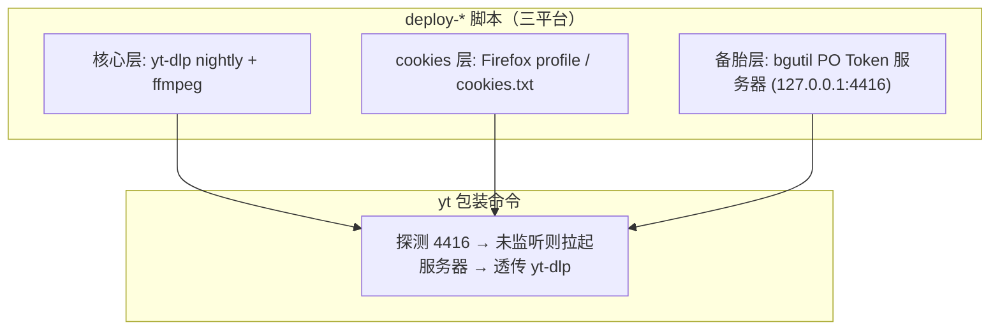
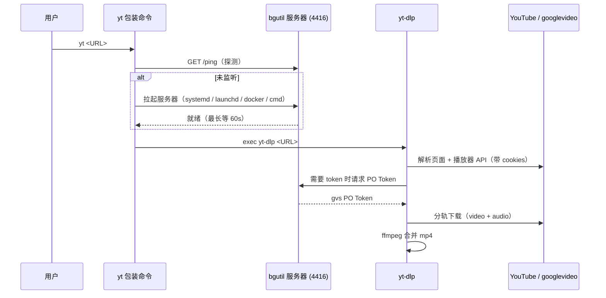

# yt-dlp-deploy-suite

一键部署 **yt-dlp YouTube 下载环境** 的脚本集，覆盖 Windows 桌面机与 Ubuntu Server（无桌面）。

> 背景：2024 年起 YouTube 上线 PO Token + SABR（服务端自适应码率），加之对数据中心 IP 的信誉封锁，
> IDM、浏览器扩展和"裸"yt-dlp 大面积 403。本仓库沉淀了一套实测可用的完整部署方案：
> **yt-dlp nightly + ffmpeg + Firefox cookies / cookies.txt + bgutil PO Token 服务器（按需自动拉起）**。

## 方案架构

| 层 | 组件 | 作用 |
|---|---|---|
| 核心 | yt-dlp（nightly）+ ffmpeg | 解析、下载、音视频合并 |
| cookies | Firefox profile 或 cookies.txt | **过 googlevideo 对数据中心 IP 封锁的关键** |
| 备胎 | bgutil PO Token 服务器（端口 4416） | 触发 bot 校验时自动参与，`yt` 命令自动拉起 |

设计原则：**先用最简配置跑通，报错再逐层加装备**——所有部署脚本均支持 `--skip-pot` 只装核心层。

### 组件架构图



### 下载时序图



## 仓库结构

```
├── windows/
│   └── deploy-ytdlp.ps1            # Windows 一键部署（winget + WinGet Links + yt.ps1）
├── macos/
│   └── deploy-ytdlp.sh             # macOS 一键部署（Apple Silicon / Intel 自适应）
└── ubuntu/
    ├── deploy-ytdlp.sh             # Ubuntu Server 本地部署（deno + systemd 用户服务）
    ├── deploy-ytdlp-docker.sh      # Ubuntu Server Docker Compose 部署
    └── docker-compose.yml          # bgutil PO Token 服务器（官方镜像）
```

### macOS（Apple Silicon / Intel，macOS 12+）

```bash
bash macos/deploy-ytdlp.sh                     # 默认：Firefox cookies + PO Token 层
bash macos/deploy-ytdlp.sh -b chrome -o ~/Movies   # 换浏览器 / 输出目录
bash macos/deploy-ytdlp.sh --skip-pot          # 先装最简版
```

架构与版本自适应，无需 Rosetta：

- 脚本按 `uname -m`（`arm64` / `x86_64`）自动选择二进制；
- **ffmpeg 按系统版本分流**：Homebrew 自 2024-10 起只为最近三个大版本（现 macOS 14+）提供
  bottle，macOS 13 及以下 brew 会退化为源码编译（ffmpeg 编译需数小时）——脚本在 macOS 14+
  走 brew，**13 及以下自动改用静态 universal 二进制**（ffmpeg-static 项目）；
- 新 Mac 首次运行需安装 Xcode Command Line Tools（脚本会弹出系统安装对话框，装完重跑）；
- 默认 shell 为 zsh，PATH 写入 `~/.zprofile`；
- PO Token 服务器用 **launchd LaunchAgent**（`RunAtLoad` + `KeepAlive`，等效 systemd）；
- 下载的静态二进制已自动清除 Gatekeeper 隔离属性（否则会被"无法验证开发者"拦截）；
- macOS 上的一个利好：Chrome/Edge cookies **可用**（走钥匙串解密，Windows 上的 app-bound
  加密问题不存在），但 Firefox 仍是最省事的选择。Safari 不受 yt-dlp 支持。

## 快速开始

### Windows（Windows 10/11，需 winget）

```powershell
# 默认：输出到 Downloads，Firefox cookies，含 PO Token 层
powershell -ExecutionPolicy Bypass -File windows\deploy-ytdlp.ps1

# 自定义示例
.\windows\deploy-ytdlp.ps1 -OutputDir "D:\YT" -CookiesBrowser chrome
.\windows\deploy-ytdlp.ps1 -SkipPotServer        # 先装最简版
```

脚本自动完成：winget 安装 yt-dlp/ffmpeg/deno → 升级 nightly → 修复用户 PATH → 写全局配置
→ 生成 `yt` 命令（自动拉起 PO Token 服务器）→ **放开 CurrentUser 的 PowerShell 执行策略**
→ 部署 bgutil 插件与服务器。

> Windows 客户端的 PowerShell 执行策略默认是 **Restricted**，会直接拦下 `yt.ps1`；脚本会自动把
> `CurrentUser` 作用域设为 `RemoteSigned`（不碰系统级、不需要管理员）。若你的机器由组策略强制
> Restricted，请改用 `yt.cmd <URL>`——`.cmd` 不受执行策略限制。

### Ubuntu Server 本地版（deno + systemd）

```bash
bash ubuntu/deploy-ytdlp.sh -o /data/downloads
# 国内网络加: --npm-mirror    跳过 token 层加: --skip-pot
```

安装内容：ffmpeg（apt）→ yt-dlp nightly（独立 venv，规避 PEP 668）→ 全局配置 → deno →
bgutil 服务器（systemd 用户服务，`Restart=on-failure` + linger 常驻）→ `~/.local/bin/yt`。

### Ubuntu Server Docker Compose 版

```bash
bash ubuntu/deploy-ytdlp-docker.sh -o /data/downloads
```

PO Token 服务器使用官方镜像 `brainicism/bgutil-ytdlp-pot-provider`，`restart: unless-stopped`，
端口仅绑定 `127.0.0.1:4416`。**注意：插件 zip 仍会装在宿主机**——容器只负责算 token，
yt-dlp 通过 HTTP 与容器通信。

## 部署后必做（cookies 层）

 cookies 是本方案**过 403 的主角**（实测可单独压过数据中心 IP 封锁）：

1. **Windows**：脚本已配置 `--cookies-from-browser firefox`，在 Firefox 登录 youtube.com 一次即可，
   下载前需完全退出 Firefox（cookie 库被锁读不了）；
2. **Ubuntu Server**：无浏览器，在任意桌面机用浏览器扩展
   **[Get cookies.txt LOCALLY](https://chromewebstore.google.com/detail/get-cookiestxt-locally/cclelndahbckbenkjhflpdbgdldlbecc)**
   从已登录的 youtube.com 页面导出 `cookies.txt`，放到 `~/.config/yt-dlp/cookies.txt`（脚本自动 chmod 600）。

> ⚠️ cookies.txt 等同于 YouTube 登录凭证：务必 `chmod 600`、不进 git、不外传。
> 建议使用小号，避免主账号被风控。掉登录（表现为全线 403）后重新导出覆盖即可。

## 日常使用

```bash
yt <视频URL>                  # 最高画质，自动合并 mp4
yt -x <视频URL>               # 只取音频（原生态 .opus，零损失）
yt -x --audio-format mp3 URL  # 转成 mp3（喂老设备时用）
yt -S "res:1080" <URL>        # 限最高 1080p
yt -a list.txt                # 批量下载（一行一个 URL）
```

## 故障排查速查

| 症状 | 原因 | 处理 |
|---|---|---|
| 解析阶段 403 / 全线 403 | cookies 失效或未配置 | 重新导出 cookies；Firefox 保持登录态 |
| `Could not copy cookie database` | 浏览器正在运行 | 完全退出浏览器再下载 |
| `Failed to decrypt with DPAPI` | Chrome/Edge 新版 app-bound 加密（Windows） | 此路不通，改用 Firefox 或 cookies.txt |
| `Sign in to confirm you're not a bot` | IP 信誉差 / 未带 cookies | cookies + PO Token 层 |
| 解析成功但下载数据 403 | 出口 IP 被 googlevideo 封锁（机房 IP 典型） | cookies 为主；换非机房出口为终极方案 |
| youtube 客户端解析报错 | YouTube 改版 | 先 `yt-dlp --update-to nightly` 再说 |
| PO Token 服务器起不来 | 依赖不完整 | `rm -rf node_modules` 后重装（脚本已内置正确姿势） |
| `无法加载文件 yt.ps1 … 在此系统上禁止运行脚本`（`PSSecurityException`） | PowerShell 执行策略为 **Restricted**（Windows 客户端默认值）；PowerShell 里同名 `.ps1` 优先于 `.cmd`，所以 `yt` 命中了脚本文件 | `Set-ExecutionPolicy -Scope CurrentUser RemoteSigned -Force`（无需管理员，部署脚本已自动处理）；不想改策略就用 `yt.cmd <URL>` |

403 定性三板斧：**换网络出口试一次**（区分 IP 层）→ **看卡在解析还是下载**（区分 token 层）→
**`yt-dlp -v <URL>` 看日志**。

## 已知坑（部署脚本已内置规避）

- yt-dlp 配置文件必须 **纯 ASCII**（GBK 系统下中文注释直接报错）；
- Ubuntu 23.04+ 的 PEP 668 不允许 pip 直装 → 脚本用独立 venv；
- bgutil 依赖安装遇残缺锁文件会装一半 → 脚本先探测再装；npmjs 直连不通 → `--npm-mirror` 走 npmmirror；
- Windows 下 deno 冷启动超过 bgutil script 模式写死的 15s 超时 → 一律用 HTTP 服务器模式；
- Windows PowerShell 默认执行策略 Restricted，会拦掉 `yt.ps1` → 部署脚本自动设 `CurrentUser=RemoteSigned`
  （只影响当前用户，可随时用 `Set-ExecutionPolicy -Scope CurrentUser Undefined` 撤销）。

## 免责声明

本项目仅供学习与个人备份用途。下载 YouTube 内容可能违反 YouTube 服务条款及当地法律，
请确保你对他人的内容有合法使用权，风险自负。本项目与 YouTube / Google 无关。

## 安全与合规

安全审计结论、第三方依赖供应链清单与用户侧自查清单见 [SECURITY.md](SECURITY.md)。
本仓库的 AI 协作开发规范见 [AGENTS.md](AGENTS.md)。

## 致谢

- [yt-dlp](https://github.com/yt-dlp/yt-dlp)
- [bgutil-ytdlp-pot-provider](https://github.com/Brainicism/bgutil-ytdlp-pot-provider)（Brainicism）

## License

[MIT](LICENSE)
